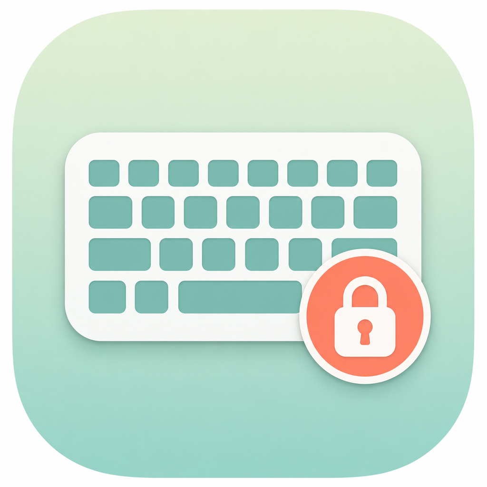

<div align="center">



# KeyboardCleaner

### Lock your Mac keyboard — to clean it, hand it to a kid, or keep a cat off the keys

A tiny **macOS menu bar app** that temporarily **disables keyboard input** so nothing
gets typed, deleted, or triggered by accident. Your mouse and trackpad keep working,
so you can unlock the instant you're done. Free, open-source, and it lives quietly in
your menu bar.

<br />


<br />

**[⬇ Install](#-install)** · **[🎬 Modes](#-modes--use-cases)** · **[✨ Features](#-features)** · **[❓ FAQ](#-faq)** · **[⚙ How it works](#-how-it-works)**

</div>

<br />

---

## 🧩 What is KeyboardCleaner?

KeyboardCleaner is the simplest way to **lock or disable your keyboard on a Mac** for a
few moments. Click the menu bar icon, pick a mode, and every keypress is blocked until
you unlock — while the pointer stays free. It's built for the little moments a keyboard
gets in the way:

- 🧽 **Cleaning** your keyboard without typing gibberish or hitting shortcuts
- 🧸 **Handing your Mac to a baby or toddler** to watch a video
- 🐱 **Keeping a cat, dog, or pet** from walking across the keys
- 🎬 **Watching a movie** without a stray keypress pausing or interrupting it
- 🤝 **Passing your laptop to someone** while keeping the keyboard locked

No Dock icon, no account, no tracking — a single-purpose utility that does one thing well.

<br />

---

## 🎬 Modes & use cases

Pick the mode that matches the moment. Choose one in the menu bar panel, hit **Start**,
and unlock anytime with your emergency shortcut (default `⌃⌥⇧⌘K`).

| Mode | What it locks | Perfect for |
|:--|:--|:--|
| 🧽 **Cleaning** | Keyboard *(mouse stays free)* | Wiping the keys without typing — optional **"also lock trackpad"** for cleaning the whole surface |
| 🧸 **Baby & Pet** | Keyboard **+ trackpad** | A toddler or cat on your lap while a video keeps playing — only the shortcut unlocks it |
| 🎬 **Movie** | Keyboard *(mouse stays free)* | Watching something without a bumped key pausing or closing it |
| 🤝 **Hand-off** | Keyboard *(mouse stays free)* | Letting someone borrow your Mac to look at the screen |

<br />

---

## ✨ Features

<table>
<tr>
<td width="33%" valign="top" align="center">

### 🔒
**Instant keyboard lock**

One click disables every key — letters, shortcuts, function and media keys.

</td>
<td width="33%" valign="top" align="center">

### 🖱
**Mouse stays alive**

Trackpad and mouse keep working, so there's never a lockout or a panic.

</td>
<td width="33%" valign="top" align="center">

### 🧸
**Four lock modes**

Cleaning, Baby &amp; Pet, Movie, Hand-off — including a full **trackpad lock**.

</td>
</tr>
<tr>
<td width="33%" valign="top" align="center">

### 🆘
**Emergency unlock**

A custom escape shortcut (default `⌃⌥⇧⌘K`) always frees you — even with the pointer locked.

</td>
<td width="33%" valign="top" align="center">

### 🖥
**Full-screen overlay**

A clear "locked" badge with a live timer so you always know the state.

</td>
<td width="33%" valign="top" align="center">

### 🎯
**Menu bar only**

No Dock clutter, launch at login, sound &amp; haptic cues — quiet and out of the way.

</td>
</tr>
</table>

<br />

---

## ⚡ Install

### Homebrew (recommended)

```bash
brew tap enesyaks/keyboardcleaner https://github.com/enesyaks/KeyboardCleaner
brew install --cask kbcler
```

> If Homebrew asks you to confirm a third-party tap/cask, type `y` to proceed.
> You can also use the fully qualified name: `brew install --cask enesyaks/keyboardcleaner/kbcler`

<table>
<tr>
<td width="50%">

**Update**

```bash
brew upgrade --cask kbcler
```

</td>
<td width="50%">

**Uninstall**

```bash
brew uninstall --cask kbcler
```

</td>
</tr>
</table>

### Manual install

| Step | Action |
|:----:|:-------|
| **1** | Download the latest `.zip` from [**Releases**](https://github.com/enesyaks/KeyboardCleaner/releases) |
| **2** | Unzip and drag `KeyboardCleaner.app` into **Applications** |
| **3** | Open the app — look for the ⌨️ icon in the menu bar |
| **4** | Grant **Accessibility** access when asked *(System Settings → Privacy & Security → Accessibility)*, then quit and reopen once |

<br />

> [!IMPORTANT]
> **"KeyboardCleaner cannot be verified" on first launch?**
> KeyboardCleaner is open-source and *ad-hoc signed* — it isn't notarized through
> a paid Apple Developer account, so macOS Gatekeeper shows a warning. The app is
> safe; you just need to allow it once.
>
> **Homebrew installs** clear this automatically. If it still appears, run:
> ```bash
> xattr -dr com.apple.quarantine /Applications/KeyboardCleaner.app
> ```
> or reinstall with `brew reinstall --cask --no-quarantine kbcler`.
>
> **Manual (.zip) installs** — pick either:
> - **Right-click** the app → **Open** → **Open** in the dialog, **or**
> - Open **System Settings → Privacy & Security**, scroll down, and click **Open Anyway**, **or**
> - Run the `xattr` command above.

<br />

---

## ❓ FAQ

<details open>
<summary><b>How do I lock or disable my keyboard on a Mac to clean it?</b></summary>

<br />

Install KeyboardCleaner, click the ⌨️ icon in the menu bar, choose **Cleaning**, and
press **Start**. Every key is disabled so you can wipe the keyboard without typing
anything. Unlock from the menu bar or with your emergency shortcut when you're done.

</details>

<details>
<summary><b>Does the mouse and trackpad still work while the keyboard is locked?</b></summary>

<br />

Yes. In Cleaning, Movie, and Hand-off modes the pointer stays fully active, so you can
always click **Unlock** in the menu bar. In **Baby &amp; Pet** mode (or Cleaning with
"also lock trackpad" turned on) the pointer is locked too — then the **emergency
shortcut** is the way out.

</details>

<details>
<summary><b>How do I lock the keyboard so my baby or cat can watch a video?</b></summary>

<br />

Pick **Baby &amp; Pet** mode. It blocks the keyboard *and* the trackpad, so a toddler
or pet can't pause, close, or mess anything up — while the video keeps playing. Only
your emergency shortcut (`⌃⌥⇧⌘K` by default) unlocks it.

</details>

<details>
<summary><b>Can I lock the trackpad too?</b></summary>

<br />

Yes — use **Baby &amp; Pet** mode, or turn on **"Also lock trackpad"** under Cleaning
mode to freeze the whole surface (great for wiping the palm rest and trackpad).

</details>

<details>
<summary><b>How do I unlock it?</b></summary>

<br />

Click **Unlock** in the menu bar, or press the **emergency shortcut** (`⌃⌥⇧⌘K` by
default, fully customizable in Settings). When the pointer is locked, the shortcut is
the only way out — by design.

</details>

<details>
<summary><b>Is it safe? Why does it need Accessibility permission?</b></summary>

<br />

It's open-source and runs entirely on your Mac — nothing is collected or sent anywhere.
macOS only lets *trusted* apps observe and block keyboard input, so Accessibility
permission is required once to make the lock work.

</details>

<details>
<summary><b>Does it work on Apple Silicon and the latest macOS?</b></summary>

<br />

Yes — it's a native Swift / SwiftUI app that runs on Apple Silicon and Intel Macs,
macOS 14 Sonoma and later.

</details>

<details>
<summary><b>Is KeyboardCleaner free?</b></summary>

<br />

Completely free and open-source. If it saves you a keyboard, a ⭐ on the repo is the
nicest thank-you.

</details>

<br />

---

## ⚙ How it works

```
   ┌──────────────┐        ┌───────────────────┐        ┌──────────────┐
   │  Pick a mode │  ───▶  │  Keyboard frozen  │  ───▶  │    Unlock    │
   │  & press Lock│        │  Mouse still free │        │  & you're done│
   └──────────────┘        └───────────────────┘        └──────────────┘
```

KeyboardCleaner installs a low-level `CGEventTap` at the session level. While locked,
every `keyDown`, `keyUp`, modifier, and system/media-key event is swallowed before it
reaches any app — so wiping across the keys can't type, delete, or trigger a shortcut.
In pointer-locking modes, mouse clicks, scrolls, and drags are blocked too (the cursor
still moves). Your emergency shortcut is the one combo always allowed through to unlock.

> **Privacy:** the Accessibility permission is required once; nothing is logged, stored,
> or sent off your Mac.

<br />

---

## 🛠 Build from source

**Requirements:** macOS 14 Sonoma or later · Swift toolchain (Xcode / Command Line Tools)

```bash
git clone https://github.com/enesyaks/KeyboardCleaner
cd KeyboardCleaner
./Scripts/build.sh
open .build/KeyboardCleaner.app
```

<details>
<summary><b>📦 Release (maintainers)</b></summary>

<br />

```bash
./Scripts/package.sh
./Scripts/release.sh
git add Casks/kbcler.rb
git commit -m "Update Homebrew cask for vVERSION"
git push
```

Without the GitHub CLI, run `./Scripts/release.sh --skip-upload`, then upload
`dist/KeyboardCleaner-VERSION.zip` on the Releases page manually.

For local development, run `./Scripts/dev-sign-setup.sh` once (creates a stable
self-signed identity) so macOS keeps the Accessibility grant across rebuilds, then use
`./Scripts/dev-run.sh`.

</details>

<br />

---

## 📁 Project layout

```
KeyboardCleaner/
├── Sources/KeyboardCleaner/
│   ├── KeyboardCleanerApp.swift   # App entry, menu bar scene, onboarding window
│   ├── KeyboardBlocker.swift      # CGEventTap that swallows keyboard/pointer events
│   ├── LockMode.swift             # The four lock modes + their behaviour
│   ├── AppState.swift             # Lock state, session timer, permission checks
│   ├── AppSettings.swift          # Persisted prefs + emergency shortcut (KeyChord)
│   ├── LockOverlay.swift          # Full-screen "locked" overlay
│   ├── Feedback.swift             # Sound + haptic cues
│   ├── AccessibilityManager.swift # AXIsProcessTrusted permission handling
│   ├── LaunchAtLogin.swift        # SMAppService login-item registration
│   ├── MenuBarPanel.swift         # Main menu bar popover UI + mode picker
│   ├── SettingsView.swift         # Settings panel + shortcut recorder
│   └── OnboardingView.swift       # First-launch walkthrough
├── Resources/                     # Icon, Info.plist, entitlements
├── Scripts/                       # build / package / release / dev helpers
└── Casks/kbcler.rb                # Homebrew cask definition
```

<br />

---

<div align="center">

**Keywords:** lock mac keyboard · disable keyboard macos · keyboard cleaner · clean keyboard without typing · baby lock mac · cat on keyboard · pet lock · movie mode · trackpad lock · menu bar app

**Author:** [enesyaks](https://github.com/enesyaks) &nbsp;·&nbsp; Requires macOS 14 Sonoma+ &nbsp;·&nbsp; Free &amp; open-source

<sub>Made for anyone who's ever been afraid to clean their keyboard — or hand it to a toddler. ⌨️✨</sub>

**If KeyboardCleaner helped, please ⭐ the repo — it genuinely helps others find it.**

</div>
